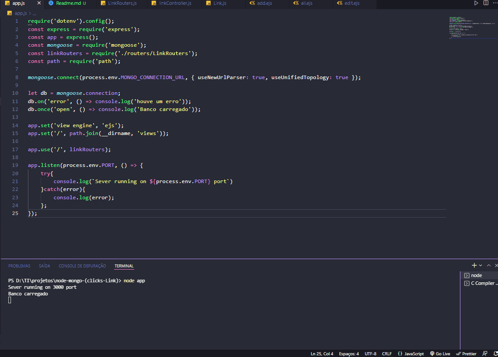
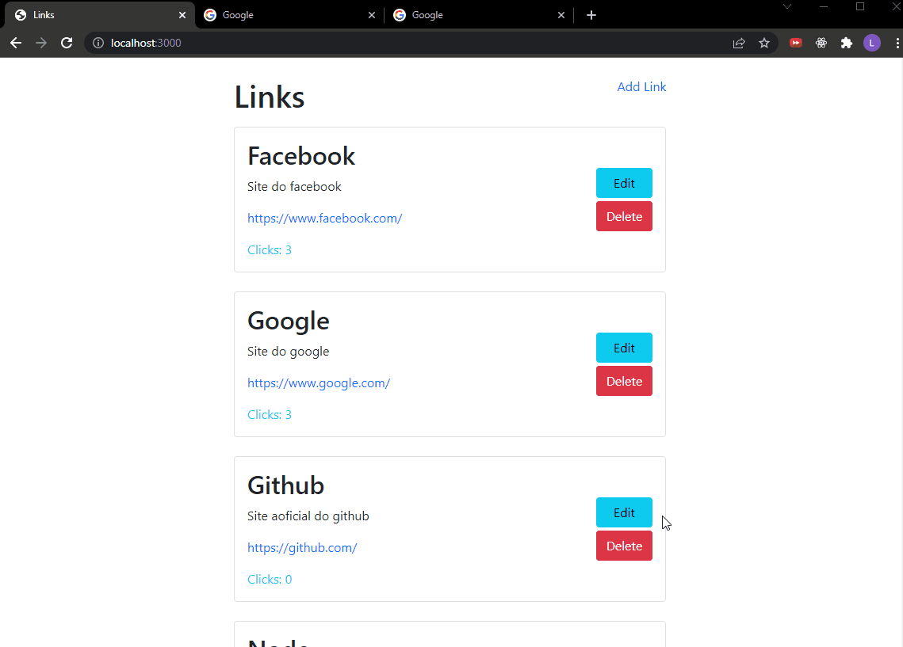
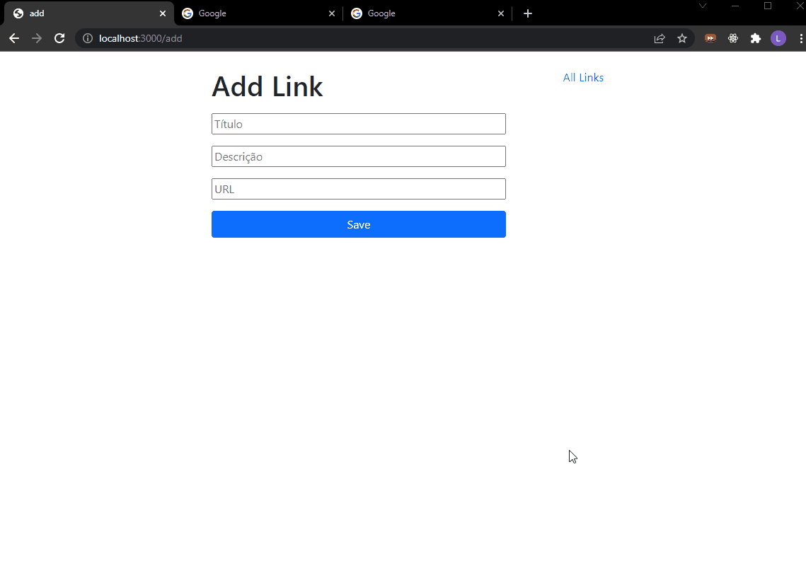
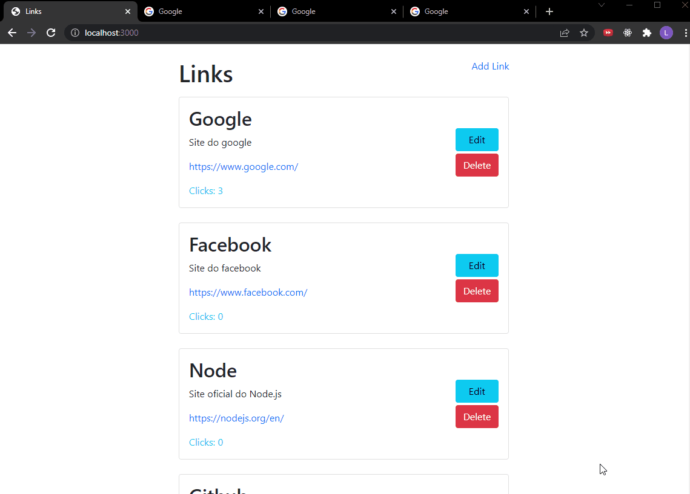
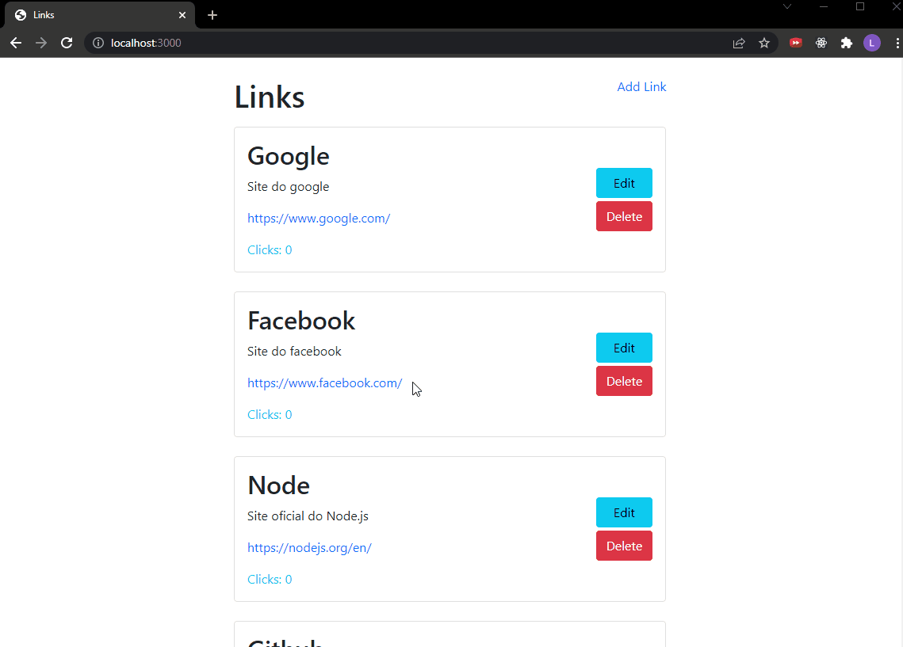

# Clicks on Link
>Aplicação em NodeJS para cadastrar links e contar quantos clicks eles recebem, e tudo fica registrado no banco de dados (MongoDB). 
---
 

  

---
  

# Funcionalidades

### Excluindo o link

  

### Adicionando link

  

### Editando link

  

### Contando clicks

 

----
  

## 👨‍💻Tecnologias usadas

✔ NodeJS

✔ MongoDB

✔ EJS

✔ Bootstrap

---
  

## Meta
**Made by:** Lucas Lopes

[Linked-in](https://www.linkedin.com/in/lucas-lopes-840965190/ "My Linked-in")

[E-mail](mailto:lucas.santos.pessoal@outlook.com "My e-mail")
